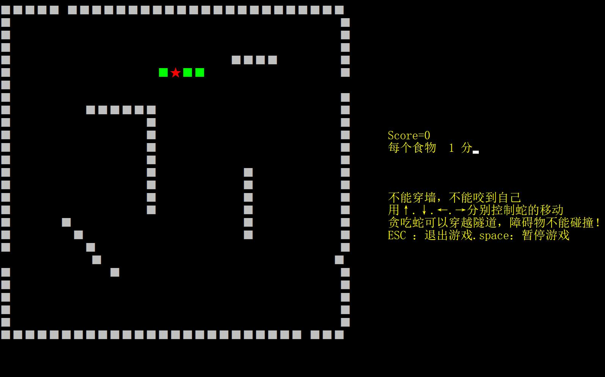

# 高级成语语言设计课程设计 -- 键盘上的贪吃蛇

## 说明

1. 课程设计按照对本门课程综合能力测试的原则，涉及本门课程的知识点包含但不仅限于两学期课程内容，如：数据类型与基本运算，逻辑语法，函数和重载，指针，引用和来与对象等。
2. 为增加课程设计的趣味性，本次课程设计安排题目为**键盘上的贪吃蛇**。设计中游戏的规则和本次课程设计积分规则在**要求**中列出，请同学们关注。
3. 本次课程设计为小组形式完成，每组两人，分组形式在微信分组助手中完成；
4. 代码在打分验收后提交的代码中有说明小组人员完成部分的说明文件。
## 要求
### 编码规则
1. 本次课程设计在CMD窗口输出，如下图所示，在设计完成的设计窗口应有游戏边界显示，障碍物显示，玩家ID和累计积分等信息；
   
2. 设置游戏欢迎界面，包括但不限于游戏名称，操作方式和玩家ID输入等；
3. 游戏窗口的范围长和宽不小于50，范围边界需设置围栏；
4. 如设置障碍物，每个障碍物长度应大于4，障碍物相连为一个障碍物，与边界相连不视为障碍物，且至少有一个障碍物为**L**型；
5. 贪吃蛇食物为随机生成，如果出现随机食物位置与蛇本身或障碍物重合，则重新生成食物，蛇身长度不变；
6. 游戏中有开始游戏，暂停游戏和结束游戏按键设置。 使用方向按键换向角度应为90°，可使用上，下，左，右或者**W，A，S，D**按键换向，使用空格键暂停游戏，使用**Esc**按键退出游戏。

### 打分规则
1. 欢迎界面：5%
2. 游戏边界显示和游戏记录信息等正确显示：10%
3. 贪吃蛇能通过键盘按键正确移动：15%
4. 食物自动生成并能够在吃完食物后成功积分：20%
5. 能通过按键开始，暂停和结束游戏：10%
6. 贪吃蛇在撞到障碍物，身体本身或者边界时结束游戏：20%
7. 界面除必要显示信息，无其他非正常显示：10%
8. 游戏要求功能完整：5%
9. 代码逻辑清晰，并有对关键部分代码注释：5%

## 加分项（5%）
* 使用不同颜色字体显示蛇体，障碍物，游戏积分等信息（1%）；
* 有难度调节接口，如设置贪吃蛇移动速度等（2%）；
* 随机出现时空穿越口（可设置在障碍物或者围栏上），贪吃蛇可以在此位置撞墙或穿越障碍物，墙体时空穿越口需成对出现（入口和出口），障碍物直接穿越（2%）；

